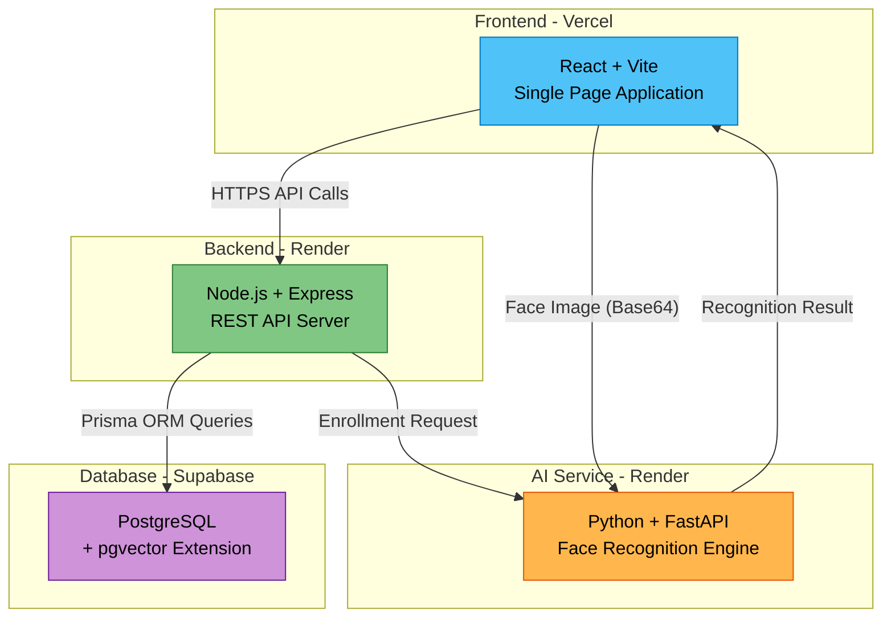
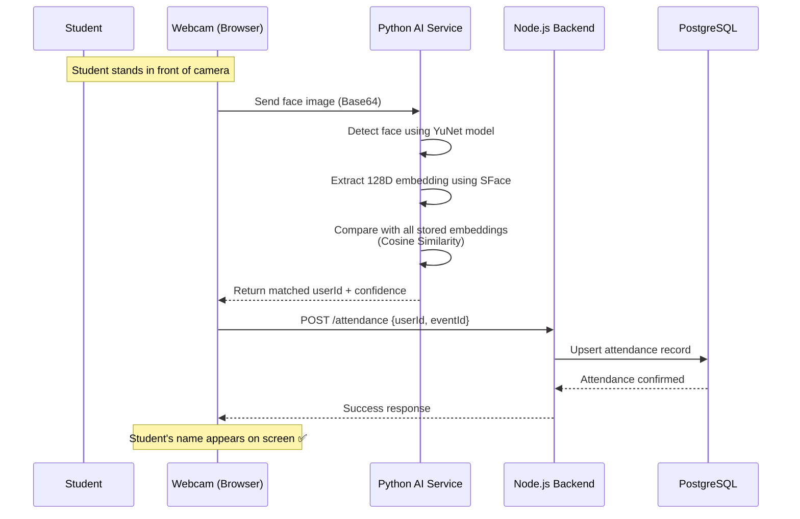
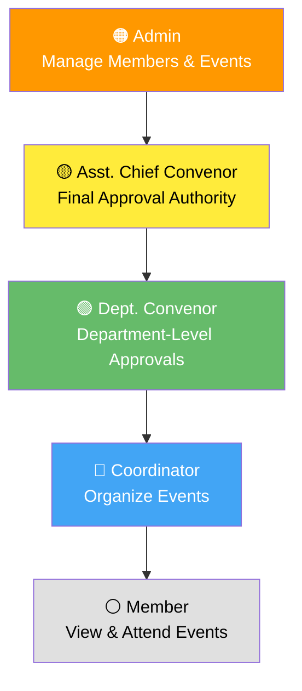
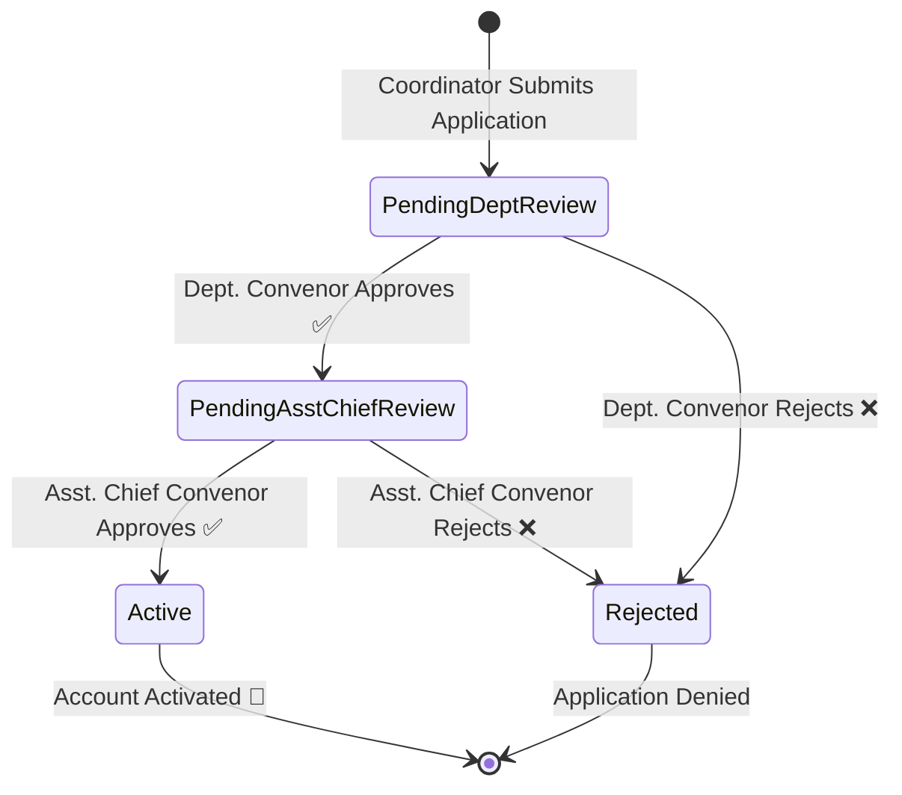
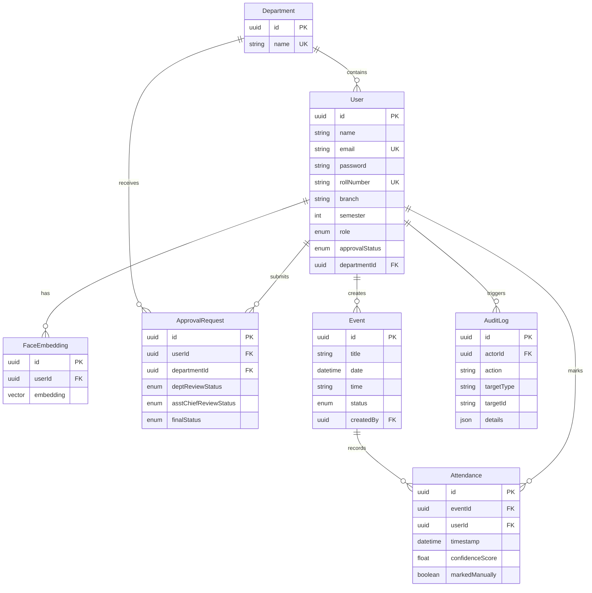
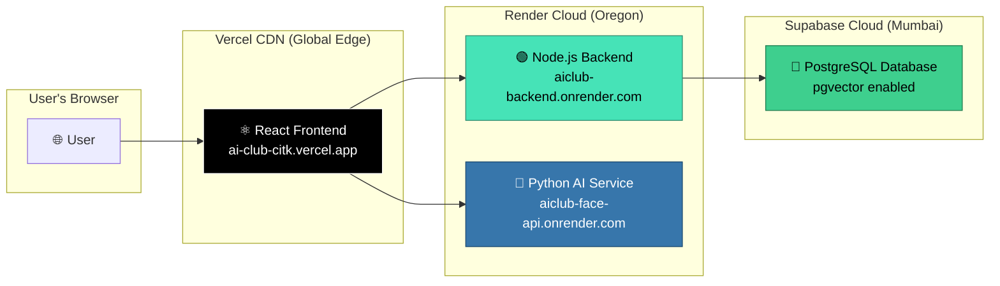

# AI Club Platform — CIT Kokrajhar
### Intelligent Member & Attendance Management System with AI-Powered Face Recognition

---

> **Developed by:** Mahea Bul & Yuvaraj Dey  
> **Institution:** Central Institute of Technology, Kokrajhar  
> **Live URL:** [https://ai-club-citk.vercel.app](https://ai-club-citk.vercel.app)  
> **GitHub:** [https://github.com/Maheabul-ofc/Ai-Club-CITK](https://github.com/Maheabul-ofc/Ai-Club-CITK)

---

## 1. Project Overview

The **AI Club Platform** is a full-stack web application built to digitize and automate the complete operations of the AI Club at CIT Kokrajhar. It replaces manual pen-and-paper workflows with a modern, intelligent system that handles:

- **AI-Powered Face Recognition Attendance** — Members simply look at a camera, and the system automatically identifies them and marks their attendance in real time.
- **Role-Based Access Control** — A hierarchical permission system with 5 distinct roles, ensuring every member sees only what they're authorized to access.
- **Multi-Stage Approval Workflow** — New coordinator applications go through a structured two-stage review process.
- **Event Management** — Create, schedule, track, and export attendance reports for club events.
- **Analytics Dashboard** — Real-time statistics and insights about club membership and activity.
- **Audit Logging** — Every critical action (member additions, role changes, deletions) is permanently recorded for accountability.

> [!IMPORTANT]
> This is not just a static website. It is a **production-grade, full-stack application** with a React frontend, a Node.js REST API backend, a Python AI microservice, and a cloud PostgreSQL database — all deployed and running live on the internet.

---

## 2. Problem Statement

Before this platform, the AI Club faced several operational challenges:

| Problem | Impact |
|:--------|:-------|
| **Manual Attendance** | Paper sign-in sheets were slow, error-prone, and easily forged. A student could sign for absent friends. |
| **No Centralized Member Database** | Member records were scattered across Excel sheets, WhatsApp groups, and paper forms. |
| **No Approval Workflow** | New member/coordinator onboarding had no formal process — just informal messages. |
| **No Event Tracking** | There was no historical record of which events happened and who attended. |
| **No Accountability** | No audit trail of who added, removed, or modified member records. |

### Our Solution

We built an end-to-end digital platform where:
1. A **camera** replaces the sign-in sheet — the AI identifies each student's face in under 1 second.
2. A **cloud database** replaces scattered spreadsheets — all member data lives in one secure, searchable location.
3. A **two-stage approval pipeline** replaces informal onboarding.
4. **Exportable CSV reports** replace manual attendance compilation.

---

## 3. System Architecture

The platform follows a modern **microservices architecture** with three independently deployable services:



### Why Microservices?

| Benefit | Explanation |
|:--------|:-----------|
| **Independent Scaling** | The AI service can be scaled independently if attendance scanning needs more compute power. |
| **Technology Freedom** | We use the best language for each job: JavaScript for web logic, Python for AI/ML. |
| **Fault Isolation** | If the AI service goes down, the rest of the platform (events, members, login) continues to work. |
| **Independent Deployment** | Each service can be updated without redeploying the others. |

---

## 4. Technology Stack

### 4.1 Frontend (Client)

| Technology | Purpose | Why We Chose It |
|:-----------|:--------|:----------------|
| **React 18** | UI Framework | Component-based architecture, massive ecosystem, industry standard |
| **Vite** | Build Tool | 10x faster than Webpack, instant hot module replacement during development |
| **Tailwind CSS** | Styling | Utility-first CSS — no separate stylesheet files, rapid UI development |
| **React Router v6** | Navigation | Client-side routing for single-page application experience |
| **TanStack Query v5** | Data Fetching | Automatic caching, background refetching, loading/error states |
| **Framer Motion** | Animations | Smooth page transitions and micro-interactions |
| **Recharts** | Data Visualization | Charts and graphs for the analytics dashboard |
| **React Webcam** | Camera Access | Browser-based webcam capture for face scanning |
| **React Hot Toast** | Notifications | Elegant success/error toast messages |
| **Axios** | HTTP Client | Promise-based HTTP requests with interceptors for JWT refresh |

### 4.2 Backend (Server)

| Technology | Purpose | Why We Chose It |
|:-----------|:--------|:----------------|
| **Node.js** | Runtime | Non-blocking I/O, perfect for handling many concurrent API requests |
| **Express.js** | Web Framework | Minimalist, flexible, and the most popular Node.js framework |
| **Prisma ORM** | Database Access | Type-safe queries, auto-generated client, easy migrations |
| **PostgreSQL** | Database | Enterprise-grade relational database with vector extension support |
| **Supabase** | Database Hosting | Free managed PostgreSQL with pgvector, real-time capabilities |
| **JSON Web Tokens (JWT)** | Authentication | Stateless auth with access + refresh token pattern |
| **bcryptjs** | Password Security | Industry-standard password hashing with salt rounds |
| **Zod** | Input Validation | Runtime schema validation for all API inputs |
| **Helmet** | Security Headers | Protects against common web vulnerabilities (XSS, clickjacking) |
| **CORS** | Cross-Origin Security | Controls which domains can access the API |
| **Morgan** | Request Logging | HTTP request logger for debugging and monitoring |

### 4.3 AI Face Recognition Service

| Technology | Purpose | Why We Chose It |
|:-----------|:--------|:----------------|
| **Python 3** | Language | The gold standard for AI/ML development |
| **FastAPI** | Web Framework | Async-native, auto-generated API docs, fastest Python framework |
| **OpenCV DNN (YuNet)** | Face Detection | Ultra-lightweight neural network (~200KB model), detects faces in images |
| **OpenCV DNN (SFace)** | Face Recognition | Generates 128-dimensional face embeddings for identity matching |
| **NumPy** | Numerical Computing | Fast vector operations for cosine similarity calculations |
| **Uvicorn** | ASGI Server | High-performance async server for FastAPI |

### 4.4 DevOps & Deployment

| Service | Role | Tier |
|:--------|:-----|:-----|
| **Vercel** | Frontend Hosting | Free |
| **Render** | Backend + AI Hosting | Free |
| **Supabase** | Managed PostgreSQL | Free |
| **GitHub** | Version Control & CI/CD | Free |

> [!TIP]
> The entire platform runs on **\$0/month** using free tiers of cloud services, making it completely sustainable for a college club.

---

## 5. Core Features — Detailed Breakdown

### 5.1 🤖 AI-Powered Face Recognition Attendance

This is the flagship feature of the platform. Instead of manually calling names or passing around a sign-in sheet, an admin simply opens the **Live Scanner** page on a laptop with a webcam.

**How it works:**



**Key Technical Details:**
- **Face Detection Model:** OpenCV YuNet — A lightweight ONNX neural network that locates faces in an image at 30+ FPS.
- **Face Recognition Model:** OpenCV SFace — Extracts a 128-dimensional numerical fingerprint (embedding) of each face. Two faces of the same person produce embeddings that are mathematically close together.
- **Matching Algorithm:** Cosine Distance — We compute `1 - cos(θ)` between the live face embedding and every stored embedding. If the distance is below 0.6, it's a match.
- **Storage:** Face embeddings are stored in a lightweight JSON database on the AI server.
- **Anti-Spoofing:** The system requires a live webcam feed, making it resistant to simple photo attacks.

### 5.2 🔐 Role-Based Access Control (RBAC)

The platform implements a 5-tier hierarchical permission system:



| Role | Capabilities |
|:-----|:-------------|
| **Admin** | Manage all departments, create/delete members, create events, view attendance reports, access analytics, view audit logs |
| **Asst. Chief Convenor** | Second-stage approval for coordinator applications |
| **Dept. Convenor** | First-stage approval for coordinator applications within their department |
| **Coordinator** | View events, assist with event organization |
| **Member** | View upcoming events, check personal attendance history, re-enroll face |

### 5.3 📋 Two-Stage Approval Workflow

When a new Coordinator signs up, their application follows a formal review pipeline:



- **Stage 1:** The Department Convenor reviews the application and can approve or reject with remarks.
- **Stage 2:** If approved by Stage 1, the Assistant Chief Convenor does a final review.
- **Result:** Only after both stages approve does the coordinator account become "Active" and gain dashboard access.

### 5.4 📊 Analytics Dashboard

Real-time statistics powered by aggregation queries:
- Total members, coordinators, and admins
- Department-wise member distribution
- Event attendance trends over time
- Interactive charts built with Recharts

### 5.5 📅 Event Management

- **Create Events** with title, date, time
- **Track Event Status**: Scheduled → In Progress → Completed
- **Live Face Scanner** for real-time attendance
- **Manual Attendance Override** for edge cases
- **Export to CSV** for offline record keeping

### 5.6 🔍 Audit Logging

Every sensitive action is recorded with:
- **Who** performed the action (actor)
- **What** they did (action type: CREATE_ADMIN, DELETE_MEMBER, APPROVE_COORDINATOR, etc.)
- **When** it happened (timestamp)
- **Target** of the action (which user/department/event was affected)
- **Additional details** (JSON metadata)

This creates an immutable accountability trail that can be reviewed by Admins at any time.

---

## 6. Database Schema

The platform uses 7 core database tables:



---

## 7. Security Measures

| Layer | Implementation |
|:------|:--------------|
| **Authentication** | JWT-based with short-lived access tokens (15 min) and long-lived refresh tokens (7 days) |
| **Password Storage** | bcrypt hashing with 12 salt rounds — passwords are never stored in plain text |
| **Input Validation** | Zod schema validation on every API endpoint to prevent injection attacks |
| **HTTP Security Headers** | Helmet.js adds headers to prevent XSS, clickjacking, MIME sniffing |
| **Rate Limiting** | Auth endpoints are rate-limited to prevent brute force attacks |
| **CORS Protection** | Only the authorized frontend domain can communicate with the backend |
| **Role-Based Authorization** | Middleware checks on every protected route ensure users can only access their permitted resources |

---

## 8. API Architecture

The backend exposes a RESTful API with the following module structure:

| Module | Base Path | Key Endpoints |
|:-------|:----------|:-------------|
| **Auth** | `/api/v1/auth` | `POST /login`, `POST /signup/member`, `POST /signup/coordinator`, `POST /refresh`, `POST /logout`, `POST /face/re-enroll` |
| **Users** | `/api/v1/users` | `GET /`, `GET /:id`, `PUT /:id`, `DELETE /:id` |
| **Departments** | `/api/v1/departments` | `GET /`, `POST /`, `PUT /:id`, `DELETE /:id`, `POST /:id/members` |
| **Approvals** | `/api/v1/approvals` | `GET /pending`, `POST /:id/review` |
| **Events** | `/api/v1/events` | `GET /`, `POST /`, `PUT /:id`, `POST /:id/attendance`, `GET /:id/attendance/export`, `GET /public` |
| **Analytics** | `/api/v1/analytics` | `GET /dashboard` |
| **Audit** | `/api/v1/audit` | `GET /logs` |
| **Leadership** | `/api/v1/leadership` | `GET /`, `POST /`, `PUT /:id`, `DELETE /:id` |

---

## 9. Deployment Architecture



| Component | Platform | URL | Region |
|:----------|:---------|:----|:-------|
| Frontend | Vercel | `ai-club-citk.vercel.app` | Global CDN |
| Backend API | Render | `aiclub-backend-34bi.onrender.com` | Oregon, US |
| Face AI | Render | `aiclub-face-api.onrender.com` | Oregon, US |
| Database | Supabase | Managed PostgreSQL | Mumbai, India |

---

## 10. Advantages of This Platform

### For the AI Club
- ✅ **Eliminates attendance fraud** — A face cannot be forged like a signature
- ✅ **Zero manual work** — Attendance is instantly digitized and exportable as CSV
- ✅ **Professional operations** — Structured workflows replace informal processes
- ✅ **Historical data** — Complete records of every event and attendee, searchable forever
- ✅ **Accountability** — Audit logs track who did what and when

### For Students (Members)
- ✅ **Fast check-in** — Just look at the camera for 1 second instead of waiting in a queue
- ✅ **Self-service portal** — View personal attendance history, update profile, re-enroll face
- ✅ **Transparent process** — Coordinator applicants can see their approval status in real-time

### Technical Advantages
- ✅ **100% Free hosting** — Runs entirely on free-tier cloud services
- ✅ **Scalable architecture** — Microservices can be independently scaled as the club grows
- ✅ **Open source** — Entire codebase is on GitHub for transparency and collaboration
- ✅ **Modern tech stack** — Uses industry-standard tools that are relevant to the job market
- ✅ **Responsive design** — Works on desktops, tablets, and mobile phones

---

## 11. Future Scope

| Enhancement | Description |
|:------------|:-----------|
| **Real-Time Notifications** | WebSocket integration (Socket.io) for live updates when approvals are processed |
| **Mobile App** | React Native companion app for on-the-go attendance and notifications |
| **Anti-Spoofing (Liveness Detection)** | Detect printed photos or screen displays to further harden security |
| **Multi-Club Support** | Extend the platform to serve all clubs at CIT, not just the AI Club |
| **Email Notifications** | Automated emails for approval status changes, event reminders |
| **QR Code Fallback** | Alternative attendance method for situations where face recognition is impractical |
| **AI Model Upgrade** | Migrate to InsightFace ArcFace model on a higher-RAM server for 99%+ accuracy |

---

## 12. How to Run Locally (Developer Setup)

### Prerequisites
- Node.js v18+
- Python 3.10+
- PostgreSQL (or a Supabase account)
- Git

### Steps

```bash
# 1. Clone the repository
git clone https://github.com/Maheabul-ofc/Ai-Club-CITK.git
cd Ai-Club-CITK

# 2. Setup Backend
cd server
cp .env.example .env        # Edit .env with your database URL and secrets
npm install
npx prisma generate
npx prisma db push
npm run seed                 # Creates the initial Admin account
npm run dev                  # Starts backend on http://localhost:5000

# 3. Setup AI Service (new terminal)
cd face-service
pip install -r requirements.txt
python -m uvicorn main:app --port 8000 --reload   # Starts AI on http://localhost:8000

# 4. Setup Frontend (new terminal)
cd client
npm install
npm run dev                  # Starts frontend on http://localhost:5173
```


---

## 13. Project Structure

```
Ai-Club-CITK/
├── client/                          # React Frontend
│   ├── src/
│   │   ├── components/              # Reusable UI components
│   │   │   ├── common/              # Button, FaceCapture, etc.
│   │   │   └── layout/              # Navbar, Footer, Sidebar
│   │   ├── contexts/                # React Context (Auth state)
│   │   ├── lib/                     # Axios instance, utilities
│   │   └── pages/
│   │       ├── public/              # Landing, Login, Signup pages
│   │       └── dashboard/           # Protected dashboard pages
│   │           ├── AdminDashboard.jsx
│   │           ├── AnalyticsDashboard.jsx
│   │           ├── AuditLogPage.jsx
│   │           ├── ProfileEditPage.jsx
│   │           └── events/
│   │               ├── EventListPage.jsx
│   │               └── LiveScannerPage.jsx
│   └── package.json
│
├── server/                          # Node.js Backend
│   ├── prisma/
│   │   ├── schema.prisma            # Database schema
│   │   └── seed.js                  # Admin account seeder
│   └── src/
│       ├── config/                  # Environment, database, constants
│       ├── middleware/              # Auth, error handler, rate limiter
│       ├── utils/                   # JWT, password hashing, logger
│       └── modules/
│           ├── auth/                # Login, signup, JWT refresh
│           ├── users/               # User CRUD operations
│           ├── departments/         # Department management
│           ├── approvals/           # Two-stage approval pipeline
│           ├── events/              # Event + Attendance management
│           ├── analytics/           # Dashboard statistics
│           ├── audit/               # Audit log queries
│           └── leadership/          # Leadership profiles
│
├── face-service/                    # Python AI Microservice
│   ├── main.py                      # FastAPI server with /enroll & /recognize
│   ├── requirements.txt             # Python dependencies
│   ├── face_detection_yunet.onnx    # Face detection model (~200KB)
│   └── face_recognition_sface.onnx  # Face recognition model (~4MB)
│
├── .gitignore
├── package.json                     # Root workspace config
└── README.md
```

---

## 14. Conclusion

The AI Club Platform demonstrates how modern web technologies and artificial intelligence can be combined to solve real-world operational problems in an educational setting. By automating attendance through face recognition, structuring member management through role-based access, and providing data-driven insights through analytics, this platform transforms the AI Club from an informally managed group into a professionally operated organization.

The project also serves as a practical learning exercise in full-stack development, microservices architecture, cloud deployment, and applied AI — making it a valuable portfolio piece for all contributors.

---

> **Crafted with ❤️ by Mahea Bul & Yuvaraj Dey**  
> Central Institute of Technology, Kokrajhar
